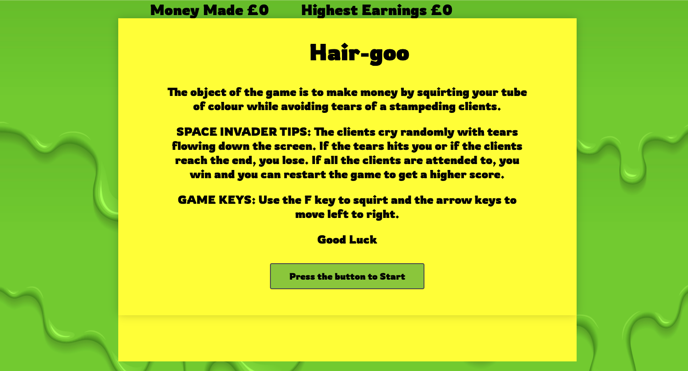
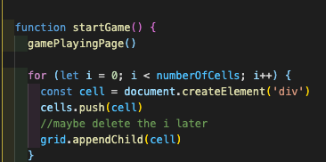
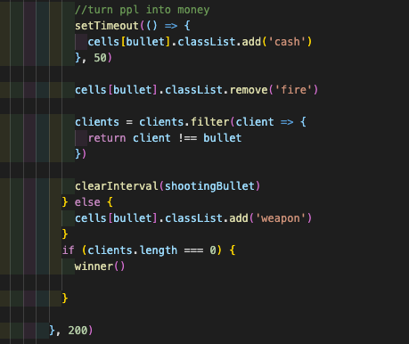
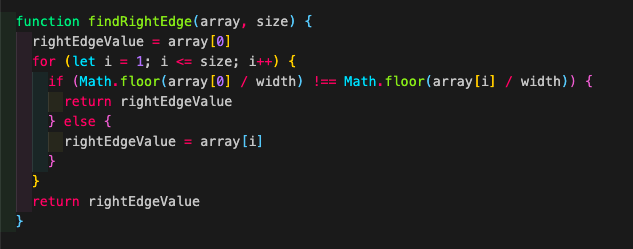
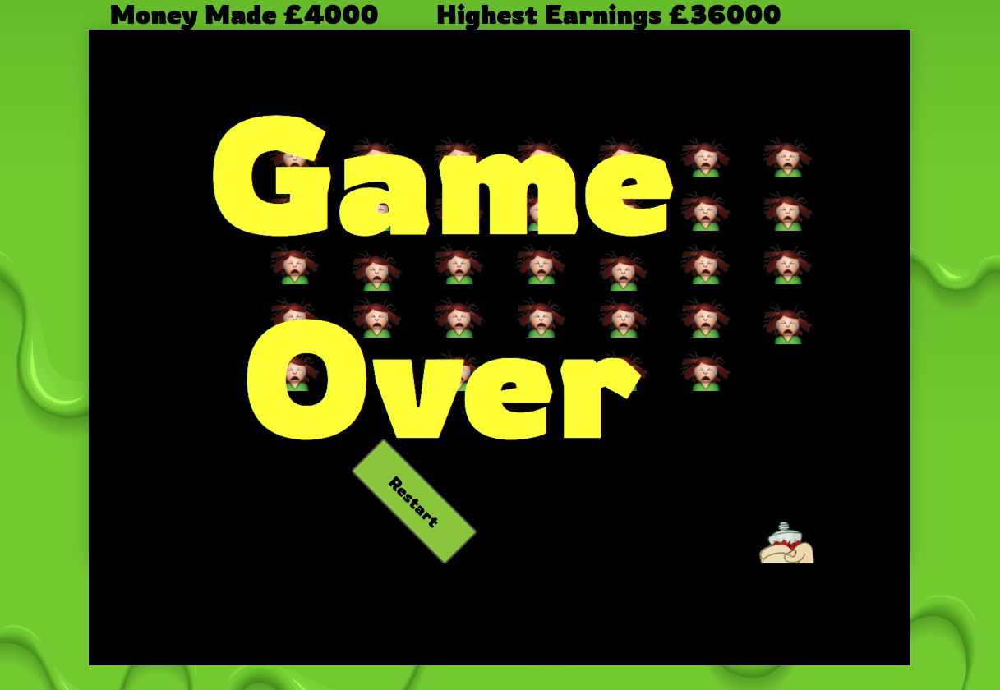

# General Assembly | Project 1 - Hair Goo

 
If you want to have a look at my game, click on:
https://becsun.github.io/SEI-project-one/

## :star2: Overview

The criteria of this project was to recrate my personal version of space invaders using only Vanilla JavaScript, HTML5 and CSS.

The objective of Space Invaders is to pan across a screen and shoot descending swarms of aliens, preventing them from reaching the bottom of the screen.

The concepts of my game is to shoot the hair 'goo' at the the on coming people before they reach the other side while avoiding collided into the hand with the goo. Being hit with their streaming tears will also end the game.

## :hourglass_flowing_sand: Timeframe

7 days

## :computer: Technologies Used

* HTML5

* CSS3

* HTML5 AUDIO

* JavaScript (ES6)

* GitHub and Git

* Google Fonts

## Technical Requirements
-  **Include separate HTML / CSS / JavaScript files**
- Use **Javascript** for **DOM manipulation**
-  **Deploy the game online**
- Use **Git** and **Github**
- Use **semantic markup** for HTML and CSS

## :pencil: Process
I needed to plan the steps I had to take in order for this game to work and be complete. I set myself a time line for my MVP and wrote down all the main functionalities I needed for the game:

- People moving forward while also moving side to side with random tears streaming.

- Player (Hand) moving side to side, while being able to shoot "goo".

- People turning into a money bill when then were hit but also disappearing after.

- Sound effects

- Scoreboard

- Win/Lose outcome

- Reset and restart the game.

  

These fuctionalities were then broken down even further through pseudocoding.

  
  

##

The grid was the foundation for me to work out how the people and also how the player can move around the page.

  

##

The code snippet below is for when a person is hit with the "goo" they would change to a money bill, and then change again to an empty grid.

##

 

This code snippet is the function that allows the people to move from one edge of the grid to the other.

## :confounded: Challenges

As the layout is set as a grid, it took me a bit of time to work out how to move both from left to right and right to left. Another challenge I had was working out how to fire the 'goo' and to replace the images from a person to a money bill then to an empty cell.

## :bug: Bugs

- Ran out of time to implement the logic to restart the game. Instead, used `window.location.reload()` to restart the page.

  
- The game still continues even though the client hits the hand with the tube of colour and also when they reach the end of the page.

## :trophy: Wins

It was an achievement to have worked alone and ended with although a little buggy, a working game

## :bulb: Key Learnings

From this experience I would definitely make sure that next time I take the time to ****break the project down into different components**** (data, presentation, views, style, DOM manipulation) and map out the details for each component individually.

Not to be afraid of writing code that I will remove later. It's all part of building the applications. The code will help get me to the the next step.

